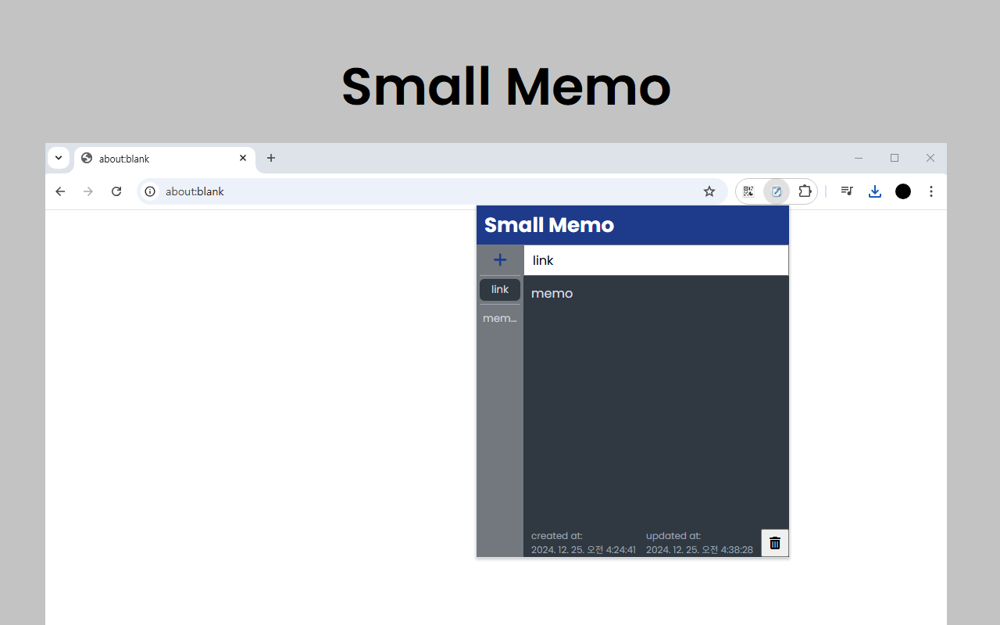

# 소개

## 프로젝트명: Small Memo

버전: 1.0.2  
링크: [chrome 웹 스토어 - Small Memo](https://chromewebstore.google.com/detail/small-memo/ckggddlehlcmegnchapdeamiolcknoae?authuser=1&hl=ko)
 

### 설명

Small Memo는 사용자가 방문 중인 웹 페이지에서 간편하게 메모를 작성하고 관리할 수 있는 크롬 확장 프로그램입니다. 사용자는 언제든지 빠르게 메모를 추가하거나 수정하고, 기존 메모를 삭제할 수 있습니다. 메모는 저장되어 페이지를 벗어나더라도 유지됩니다.

### 주요 기능:

- 간편한 메모 추가: 사이드바에서 새 메모 버튼을 클릭해 빠르게 메모를 생성할 수 있습니다.
- 메모 편집 및 업데이트: 작성 중인 메모는 자동으로 업데이트됩니다. 메모 제목과 본문이 실시간으로 수정됩니다.
- 메모 삭제 기능: 필요 없는 메모는 삭제할 수 있으며, 삭제 전 확인 팝업이 표시됩니다.
- 날짜 기록: 메모의 생성 및 수정 날짜가 기록되어 언제 작성했는지 확인할 수 있습니다.

### 기술 스택:

- HTML/CSS: UI 디자인 및 레이아웃 구성
- JavaScript: 메모 추가, 편집, 삭제 및 저장 로직 구현
- Chrome Extension Manifest V3: 크롬 확장 프로그램 개발 표준을 따릅니다.

### 권한:

- storage: 확장 프로그램에서 메모 데이터를 저장하고 불러올 수 있는 권한을 사용합니다.

 

## 빌드 및 설치

이 프로젝트는 빌드 과정이 필요 없는 순수 HTML/CSS/JavaScript로 구성된 Chrome 확장 프로그램입니다.

### 로컬 개발 환경에서 로드하기

1. Chrome 브라우저를 열고 주소창에 `chrome://extensions/` 입력
2. 우측 상단의 **개발자 모드** 토글을 활성화
3. **압축해제된 확장 프로그램을 로드합니다** 버튼 클릭
4. 프로젝트 폴더(`small-memo`) 선택
5. 확장 프로그램이 로드되면 Chrome 툴바에 아이콘이 표시됩니다

### Chrome Web Store에 제출하기

1. 프로젝트 폴더를 ZIP 파일로 압축
2. [Chrome Web Store Developer Dashboard](https://chrome.google.com/webstore/devconsole)에 접속
3. 새 항목 만들기 또는 기존 항목 업데이트
4. ZIP 파일 업로드 및 제출

 
 

# history

## Release

| 버전        | 날짜       | 상태 | 설명                                                                                                                                                                                                  |
| ----------- | ---------- | ---- | ----------------------------------------------------------------------------------------------------------------------------------------------------------------------------------------------------- |
| 1.0.2       | 2026.01.04 | 게시 | - mac에서 데이터 저장되지 않는 문제 해결                                                                                                                                                              |
| 1.0.1       | 2024.12.26 | 게시 | - 첫 팝업 로드 시 메모의 추가날짜 Invalid Date 표시되는 문제 해결  - 제목 수정 시 버튼에 반영되지 않는 문제 해결  - 사이드바 메모 호버 시 title 노출   - 사이드바 메모 호버 시 색상 변경  |
| 1.0.0 (MVP) | 2024.12.25 | 게시 | - MVP  - 메모 작성, 수정, 삭제 기능 추가  - 수정 최신순 정렬 기능 추가  - `chrome.storage.local` 데이터 저장                                                                                 |

 

## Project

| 날짜       | 버전        | 설명                                  |
| ---------- | ----------- | ------------------------------------- |
| 2026.01.05 | 1.0.2       | Chrome Web Store에 게시               |
| 2026.01.04 | 1.0.2       | Chrome Web Store에 제출하여 검토 요청 |
| 2024.12.26 | 1.0.1       | Chrome Web Store에 게시               |
| 2024.12.26 | 1.0.1       | Chrome Web Store에 제출하여 검토 요청 |
| 2024.12.25 | 1.0.0 (MVP) | Chrome Web Store에 게시               |
| 2024.12.25 | 1.0.0 (MVP) | Chrome Web Store에 제출하여 검토 요청 |

  
